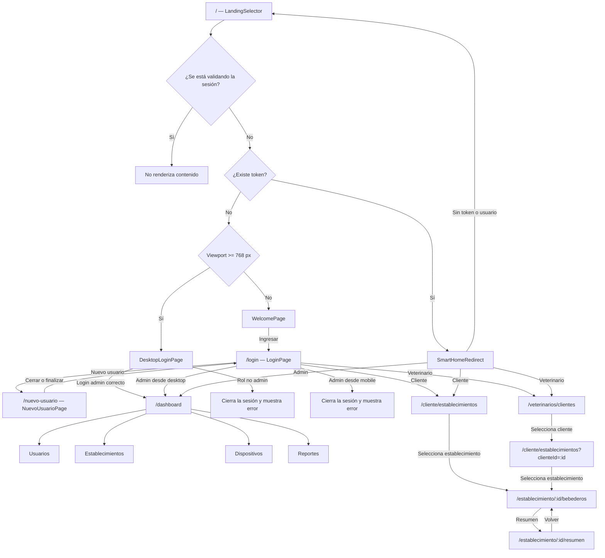
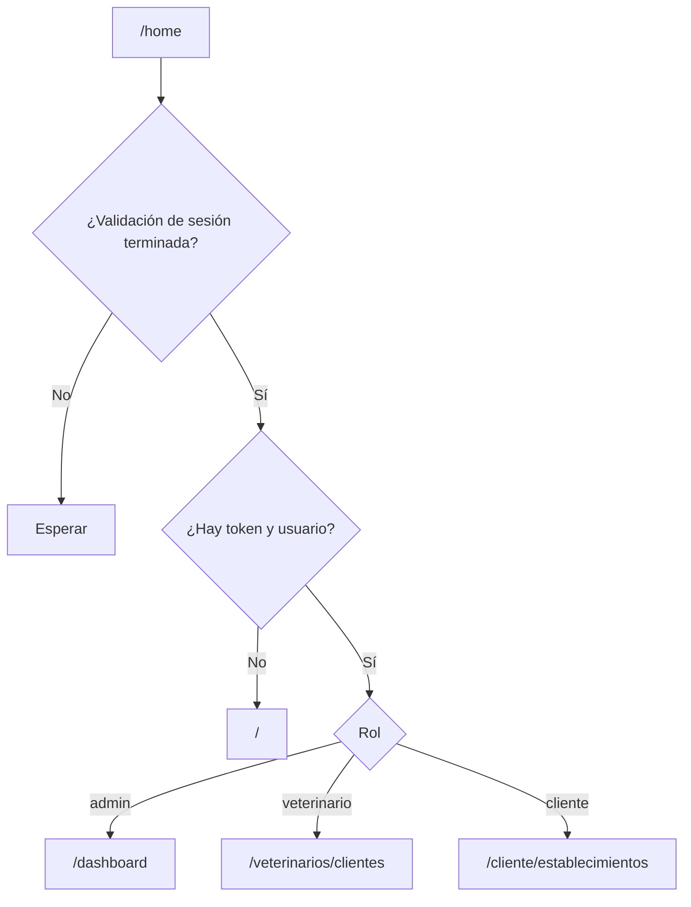
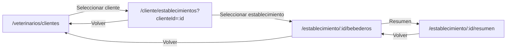
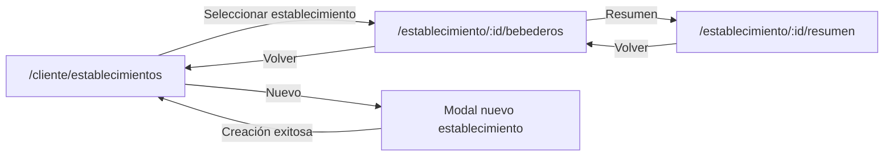

# Flujo real de navegación del frontend

Este documento describe la navegación implementada actualmente en el frontend. Fue elaborado a partir de las rutas, redirecciones, validaciones de sesión y llamadas a `navigate()` presentes en el código. El esquema de referencia original se utilizó únicamente como guía visual.

## 1. Conceptos principales

- El enrutamiento utiliza `BrowserRouter` y se define en `src/App.tsx`.
- La aplicación considera **desktop** un viewport de `768 px` o más. La decisión se realiza con `useIsDesktop()`.
- La sesión se guarda en `sessionStorage` mediante `AuthProvider`.
- Al recuperar una sesión, el frontend valida el token contra `GET /api/v1/auth/me` antes de permitir la navegación privada.
- Los roles reconocidos son `admin`, `veterinario` y `cliente`.
- `SmartHomeRedirect` es el punto central para enviar a cada usuario autenticado a su pantalla principal.
- Las rutas públicas usan `PublicLayout`; las privadas pasan por `ProtectedRoute` y `PrivateLayout`.
- No existe actualmente una ruta comodín (`*`) para páginas inexistentes.

## 2. Diagrama general

## 3. Entrada pública y selección de experiencia

### Ruta `/`

Componente: `LandingSelector`.

1. Espera a que `AuthProvider` termine de validar una sesión existente.
2. Si existe un token válido, renderiza `SmartHomeRedirect`.
3. Si no existe token:
   - En desktop (`>= 768 px`) muestra `DesktopLoginPage` dentro de la misma ruta `/`.
   - En mobile (`< 768 px`) muestra `WelcomePage` dentro de `/`.

La selección depende del ancho actual de la ventana y se actualiza al redimensionarla.

### Welcome mobile

Componente: `WelcomePage`.

- Se muestra en `/` para un visitante mobile.
- También está expuesto directamente mediante `/home-mobile`.
- El botón **Ingresar** inicia una transición de 600 ms y navega a `/login` con `replace`.

### Acceso desktop

Componente: `DesktopLoginPage`.

- Se muestra en `/` para un visitante desktop.
- También está expuesto directamente mediante `/home-desktop`.
- El botón **Ingresar** abre el formulario en un modal.
- Solo acepta cuentas con rol `admin`.
- Un login administrativo exitoso navega a `/dashboard`.
- Si las credenciales pertenecen a otro rol, se elimina la sesión recién creada y se muestra un error.

## 4. Login mobile y registro

### Ruta `/login`

Componente: `LoginPage`.

Después de autenticar, la navegación depende del rol:

| Rol | Condición | Destino |
|---|---|---|
| `admin` | Viewport desktop | `/dashboard` |
| `admin` | Viewport mobile | Se cierra la sesión y se informa que el panel solo está disponible en desktop |
| `veterinario` | Cualquier viewport que use esta pantalla | `/veterinarios/clientes` |
| `cliente` | Cualquier viewport que use esta pantalla | `/cliente/establecimientos` |

Acciones secundarias:

- **Nuevo usuario** navega a `/nuevo-usuario`.
- **Recuperar contraseña** abre un modal informativo; actualmente no navega ni ejecuta recuperación real.

### Ruta `/nuevo-usuario`

Componente: `NuevoUsuarioPage`.

- Renderiza el formulario de alta pública.
- Al cerrar el formulario navega nuevamente a `/login`.
- La ruta pertenece a `PublicLayout`.

## 5. Redirección central por rol

### Ruta `/home`

Componente: `SmartHomeRedirect`.

No muestra una pantalla propia. Decide el destino de la sesión:

El botón **Inicio** del footer mobile navega a `/home`, por lo que siempre vuelve al inicio correspondiente al rol autenticado.

## 6. Protección de rutas

Las rutas privadas están envueltas por dos controles:

1. `ProtectedRoute` verifica la inicialización, el token, el usuario y opcionalmente el rol.
2. `PrivateLayout` vuelve a comprobar que exista token.

Comportamiento de `ProtectedRoute`:

- Mientras se valida la sesión muestra `Validando sesión…`.
- Sin token o usuario redirige a `/`.
- Si la ruta exige un rol distinto:
  - Un administrador es enviado a `/dashboard`.
  - Un cliente o veterinario es enviado a `/home-mobile`.

Solo las rutas del dashboard declaran actualmente `roles={["admin"]}`. Las demás rutas privadas requieren autenticación, pero no restringen explícitamente el rol desde el router.

## 7. Flujo del administrador

### Rutas

| Ruta | Componente | Resultado inicial |
|---|---|---|
| `/dashboard` | `HomePageDashboard` | Pestaña Usuarios |
| `/dashboard/dispositivos` | `HomePageDashboard` | Pestaña Dispositivos |
| `/dashboard/dispositivos/nuevo` | `HomePageDashboard` | Pestaña Dispositivos |

`HomePageDashboard` agrega una validación adicional: si el usuario no es administrador, navega a `/home`.

### Navegación entre paneles

El dashboard contiene cuatro pestañas:

- Establecimientos → `EstablecimientoPanel`.
- Usuarios → `UsersPanel`.
- Dispositivos → `BebederosPanel`.
- Reportes → `ReportsPanel`.

Salvo la inicialización basada en las rutas de dispositivos, el cambio de pestaña se guarda como estado local. Por ejemplo, pulsar **Reportes** no modifica la URL a `/dashboard/reportes`.

La función que interpreta la URL reconoce segmentos `establecimientos`, `reportes` y `dispositivos`, aunque `App.tsx` solo registra explícitamente las tres rutas indicadas en la tabla anterior.

### Modales del dashboard

Las altas, ediciones, eliminaciones, asignaciones y simulaciones se abren como modales sobre el panel activo. No representan nuevas rutas y, por lo tanto, al recargar la página se pierde el modal abierto.

### Cierre de sesión

El botón **Cerrar sesión** del encabezado:

1. Navega a `/` con `replace`.
2. Elimina token y usuario de la sesión.

## 8. Flujo mobile del veterinario

### `/veterinarios/clientes`

Componente: `LandingClientes`.

- Consulta el perfil mediante `/api/v1/veterinarios/me`.
- Muestra los clientes asignados.
- Al seleccionar uno navega a `/cliente/establecimientos?clienteId=<id>`.

### `/cliente/establecimientos?clienteId=:id`

Componente compartido: `LandingEstablecimientos`.

Cuando el rol es veterinario:

1. Exige el parámetro `clienteId`.
2. Verifica que el cliente esté dentro de `/api/v1/veterinarios/me`.
3. Consulta sus establecimientos.
4. Muestra la razón social del cliente como título.
5. El botón volver navega a `/veterinarios/clientes`.

El veterinario no ve la acción para crear establecimientos.

## 9. Flujo mobile del cliente

### `/cliente/establecimientos`

Componente: `LandingEstablecimientos`.

Cuando el rol es cliente:

- Consulta `/api/v1/clientes/me`.
- Muestra los establecimientos propios.
- La acción **+ Nuevo** abre `NuevoEstablecimientoClienteForm` como modal.
- Una creación exitosa cierra el modal y recarga el listado sin cambiar la URL.
- No se muestra un botón volver en el encabezado.

## 10. Navegación por establecimiento

### `/establecimiento/:id/bebederos`

Componente: `LandingBebederos`.

- Obtiene el establecimiento y sus bebederos usando el parámetro `:id`.
- **Resumen** navega a `/establecimiento/:id/resumen`.
- El destino de **Volver** depende del rol:
  - Cliente → `/cliente/establecimientos`.
  - Cualquier otro rol autenticado → `/veterinarios/clientes`.

En el regreso de un veterinario desde esta pantalla no se conserva `clienteId`; vuelve al listado general de clientes.

### `/establecimiento/:id/resumen`

Componente: `LandingResumen`.

- Reutiliza el identificador del establecimiento.
- Muestra el resumen histórico de sus bebederos.
- **Volver** navega a `/establecimiento/:id/bebederos`.

## 11. Navegación inferior mobile

Las pantallas de selección, bebederos y resumen utilizan `LandingMobileLayout`, compuesto por `HeaderMobile`, contenido y `Footer` fijo.

| Acción | Comportamiento |
|---|---|
| Inicio | Navega a `/home`; `SmartHomeRedirect` decide el destino por rol |
| Soporte Técnico | Abre `SupportWhatsAppModal` sin cambiar la URL |
| Salir | Navega a `/` y elimina la sesión |

El modal de soporte permite elegir una categoría y escribir una descripción. Luego abre `wa.me` con un mensaje prearmado. No crea una ruta ni utiliza el backend.

`PublicLayout` oculta el footer mobile en `/`, `/home-mobile` y `/login`. En otras rutas públicas mobile puede mostrarlo; en desktop utiliza `FooterDesktop`.

## 12. Inventario de rutas reales

| Ruta | Pública/privada | Restricción explícita | Componente principal |
|---|---|---|---|
| `/` | Pública | Ninguna | `LandingSelector` |
| `/login` | Pública | Ninguna | `LoginPage` |
| `/home` | Pública | Decide según sesión | `SmartHomeRedirect` |
| `/nuevo-usuario` | Pública | Ninguna | `NuevoUsuarioPage` |
| `/home-desktop` | Pública | Ninguna | `DesktopLoginPage` |
| `/home-mobile` | Pública | Ninguna | `WelcomePage` |
| `/dashboard` | Privada | `admin` | `HomePageDashboard` |
| `/dashboard/dispositivos` | Privada | `admin` | `HomePageDashboard` |
| `/dashboard/dispositivos/nuevo` | Privada | `admin` | `HomePageDashboard` |
| `/bebederos` | Privada | Cualquier usuario autenticado | `BebederosPanel` |
| `/veterinarios/clientes` | Privada | Cualquier usuario autenticado | `LandingClientes` |
| `/cliente/establecimientos` | Privada | Cualquier usuario autenticado | `LandingEstablecimientos` |
| `/establecimiento/:id/bebederos` | Privada | Cualquier usuario autenticado | `LandingBebederos` |
| `/establecimiento/:id/resumen` | Privada | Cualquier usuario autenticado | `LandingResumen` |

## 13. Observaciones sobre el flujo actual

Estas observaciones describen el código vigente; no implican que sean el comportamiento deseado:

1. `/home-mobile` y `/home-desktop` son rutas públicas directas y no verifican el dispositivo antes de renderizar.
2. Las rutas mobile privadas no declaran roles específicos en `App.tsx`. La autorización de datos depende principalmente del backend y de la lógica interna de cada pantalla.
3. `/bebederos` permite cualquier rol autenticado y renderiza directamente un panel administrativo.
4. Cuando un cliente o veterinario intenta ingresar a una ruta reservada al administrador, `ProtectedRoute` lo envía a `/home-mobile`, no a `/home`.
5. Las pestañas del dashboard no sincronizan normalmente su selección con la URL.
6. `/dashboard/dispositivos/nuevo` selecciona Dispositivos, pero no abre automáticamente el modal de alta.
7. No hay una pantalla 404 ni una redirección para rutas desconocidas.
8. La navegación de regreso desde los bebederos del veterinario pierde el cliente previamente seleccionado.

Estas diferencias son relevantes si se desea convertir la navegación en enlaces compartibles, aplicar permisos estrictos por rol o conservar el contexto al usar atrás y adelante del navegador.
